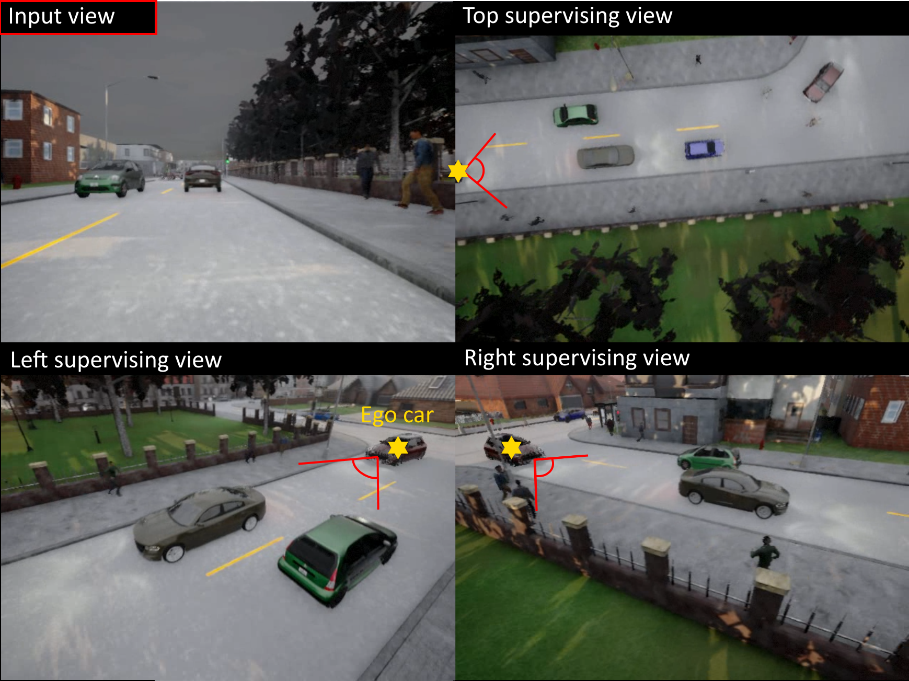

# Dataset Code for Revealing Occlusions with 4D Neural Fields

GREATER and CARLA-4D -- two synthetic datasets that are released alongside our CVPR 2022 paper "Revealing Occlusions with 4D Neural Fields".

See the [main repository here](https://github.com/basilevh/occlusions-4d).

**[Click here](https://forms.gle/AqJ1kcwEJNJkvqpdA) to access the already generated data that we actually used to train and evaluate our models.**

This repository contains the video generation code, which may be useful if you want to tweak the simulators or environments from which our datasets are sourced.

[Paper](https://arxiv.org/pdf/2204.10916.pdf) | [Website](https://occlusions.cs.columbia.edu/) | [Code](https://github.com/basilevh/occlusions-4d)

## GREATER

This is based on [CATER](https://rohitgirdhar.github.io/CATER/), which is originally based on [CLEVR](https://cs.stanford.edu/people/jcjohns/clevr/).

Please see `greater_gen_commands.sh`, which runs `render_videos.py` and `postprocess_dataset.py`.

I recommend parallelizing the data generation via multiple tmux panes.

<!---
Please note that the depth map in GREATER is actually the distance from the camera plane, not the camera itself.
-->

## CARLA-4D

This dataset uses the [CARLA simulator](https://carla.org/).

After installing CARLA (see [this guide](https://carla.readthedocs.io/en/latest/start_quickstart/)), first run:
```
./CarlaUE4.sh -carla-world-port=$PORT -RenderOffScreen -graphicsadapter=2 -nosound -quality-level=Epic
```
where 2 is your 0-based GPU index. No display is needed if you run the command this way (also called _headless_), so it is suited for Linux machines that you may be operating remotely.

Then, see `carla_gen_commands/`. These scripts execute the Python files `record_simulation.py`, `capture_sensor_data.py`, and `video_scene.py` in that order, parallelizing across separate CARLA instances running on different GPUs (if you have multiple).

I used the following eight maps: Town01, Town02, Town03, Town04, Town05, Town06, Town07, Town10HD.

An optional final step is to run `meas_interest.py` to generate `occlusion_rate` files, intended for training the [model in our paper](https://arxiv.org/pdf/2204.10916.pdf) specifically.

Some examples of the raw RGB views as well as the merged point clouds (colored according to semantic category) are shown below.

<p align="center">
  
</p>

https://user-images.githubusercontent.com/18504625/211918236-414f474b-8da8-4df1-9f45-9ee1db66e12e.mp4
